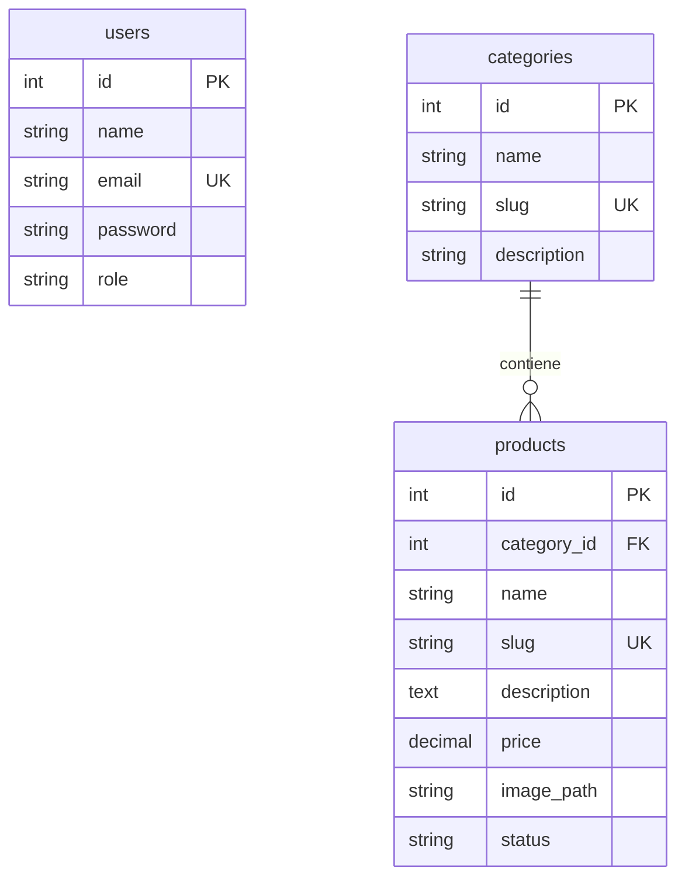

# Modelo de Base de Datos - SnackConnect Laravel (Portabilidad SQLite)

El esquema está optimizado para SQLite. Las llaves foráneas se mantendrán simples para evitar problemas de compatibilidad y bloqueos de tabla.

## 1. Diseño Lógico de Datos

## 2. Diccionario de Campos y Validaciones
*   **Restricciones de Integridad:**
    *   `categories.slug` y `products.slug` deben generarse automáticamente a partir de los nombres (`Str::slug`) para asegurar rutas URL limpias y amigables.
    *   La relación `products.category_id` tendrá la cláusula `onDelete('cascade')` para limpiar productos si una categoría es eliminada por el administrador.
    *   El campo `products.status` será de tipo String (`active` o `inactive`), evitando tipos Enum nativos que en algunas versiones antiguas de SQLite pueden presentar incompatibilidades.
